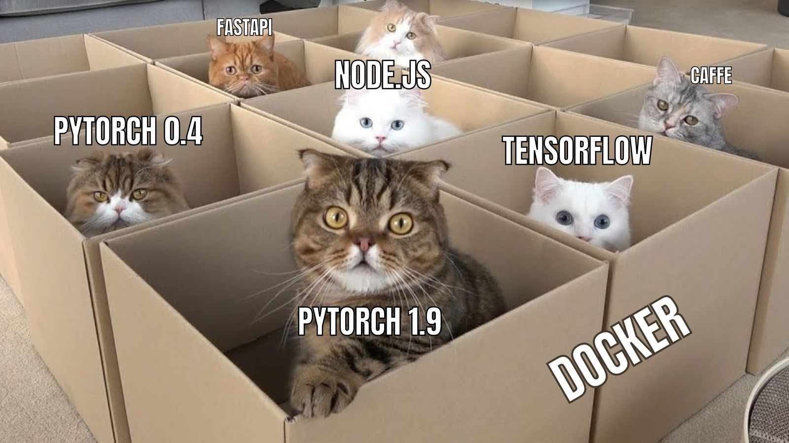
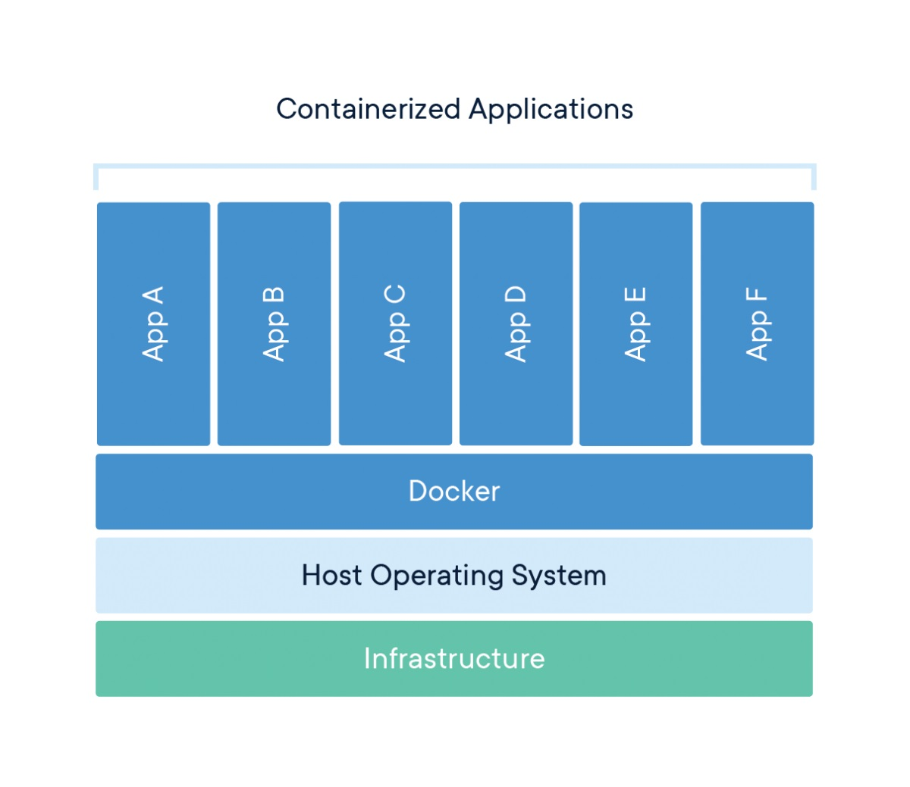

# Docker Intro

## What is Docker?

From Docker web site:

* A container is a standard unit of software that packages up code and all its dependencies so the application runs quickly and reliably from one computing environment to another. 

* A Docker container image includes everything needed to run an application:
  * code
  * runtime
  * system tools
  * system libraries
  * settings

* Container images become containers at runtime.

* In the case of Docker containers - images become containers when they run on Docker Engine. 

* Containerized software will always run the same, regardless of the infrastructure. 
  * Containers isolate software from its environment.
  * 

---
## Advantages of using containers / Docker

* Allows us to isolate apps from their environment.
  * Easily manage dependencies by isolating them
    - Install system libraries without worries
  * Easily manage multiple CUDA versions on the same machine
    - No CUDA installation headaches like [infinite login loops](https://forums.developer.nvidia.com/t/infinite-login-loop-after-attempted-runfile-installation-of-cuda-8-0-toolkit-on-ubuntu-14-04/47260)

* Solving the “it works on my machine” headache.
  * Much more reproducible

* Learn once, use everywhere: same technology for various programming languages.
  * Python: Anaconda, virtualenv
  * Node.js: nodeenv
  * etc

---
## Disadvantages of using containers / Docker

Compared to a standard virtual environment like Anaconda / virtualenv:
  * Heavier.
    - Takes up significantly more disk space
    - Slightly longer container startup time

  * Steep learning curve.
    - Dockerfile
    - Port forwarding
    - Container launch commands

  * Can be harder to debug due to the stronger app isolation.
    - Potential solution: debug using VS Code with Remote Containers extension
