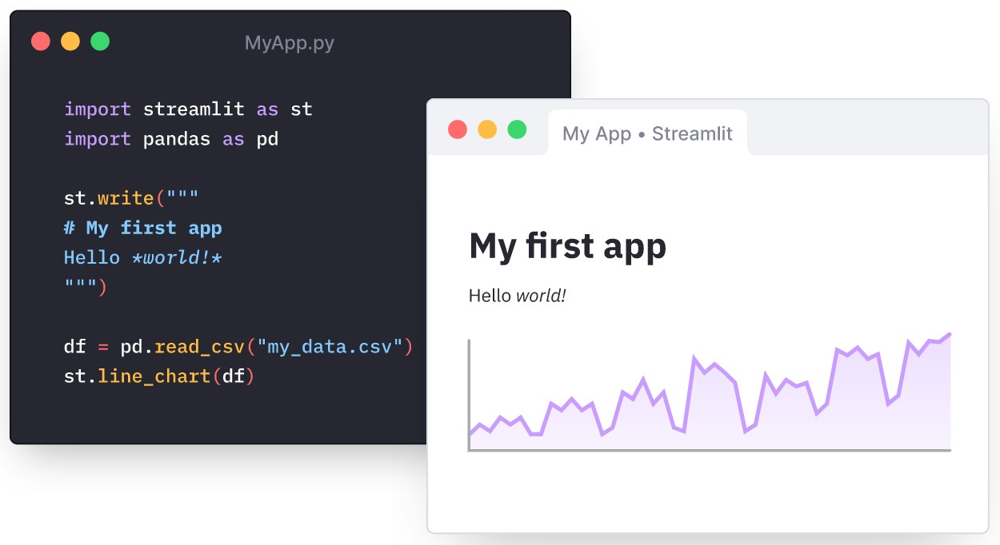
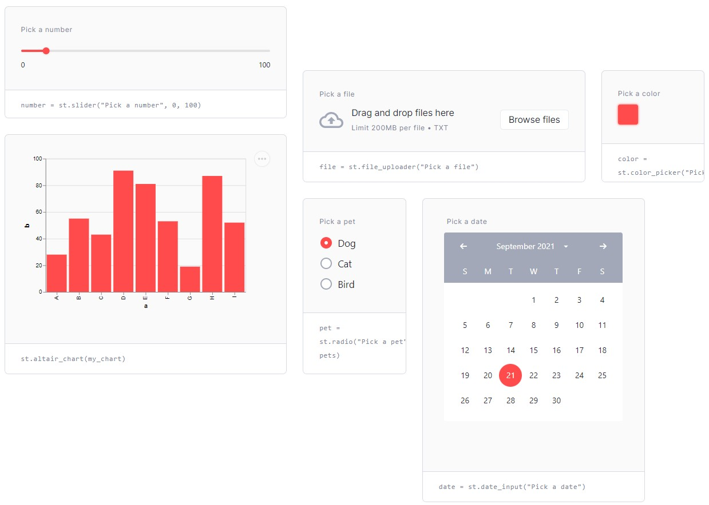

# Streamlit Intro

## What is Streamlit?

From Streamlit web site:

* An open-source Python library for turning data scripts into shareable web apps.

* Build an interactive frontend by writing Python scripts.
  * 

* Allows us to add interactive widgets by just declaring a variable.
  * No need to write a backend, define routes, handle HTTP requests, connect a frontend, write HTML, CSS, JavaScript, etc
  * 

---
## Streamlit use cases

* Data exploration
* Data visualisation
* Simple web frontend (demo / debugging purposes)

---
## Cheat sheet

https://share.streamlit.io/daniellewisdl/streamlit-cheat-sheet/app.py

