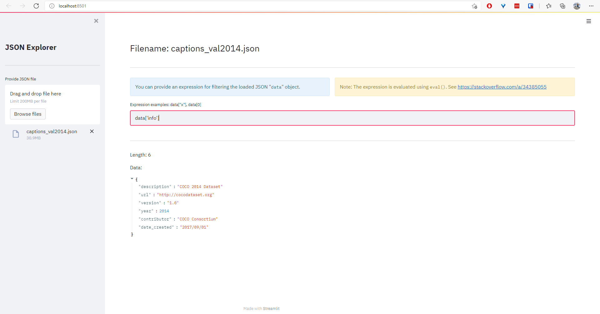

# Streamlit Demo

A Streamlit UI tool for exploring MS-COCO captions.

Just clone this repo and start exploring.

## Explore generated captions on MS-COCO

Run `streamlit run src/streamlit_captions.py`

Demo:
1. Unzip `demo/data.zip`
2. Run the script
3. Screenshot:
    

## Explore JSON file

Run `streamlit run src/streamlit_json.py`

Demo:
1. Unzip `demo/data.zip`
2. Run the script
3. Screenshot:
    
