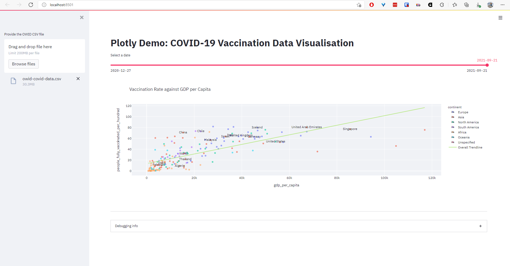
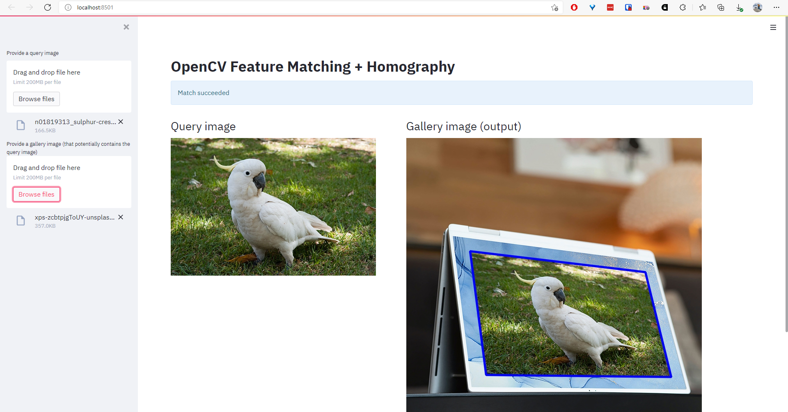
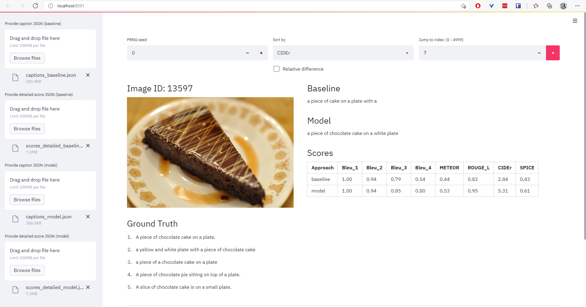

# Streamlit Demo

Streamlit demos.

## Explore JSON file

Run `streamlit run src/streamlit_json.py`

Screenshot: 

## Explore COVID-19 Vaccination Data

Run `streamlit run src/streamlit_plotly.py`

Screenshot: 

## Demo OpenCV

Run `streamlit run src/streamlit_image.py`

Screenshot: 

## Explore generated captions on MS-COCO

Run `streamlit run src/streamlit_captions.py`

Screenshot: 
